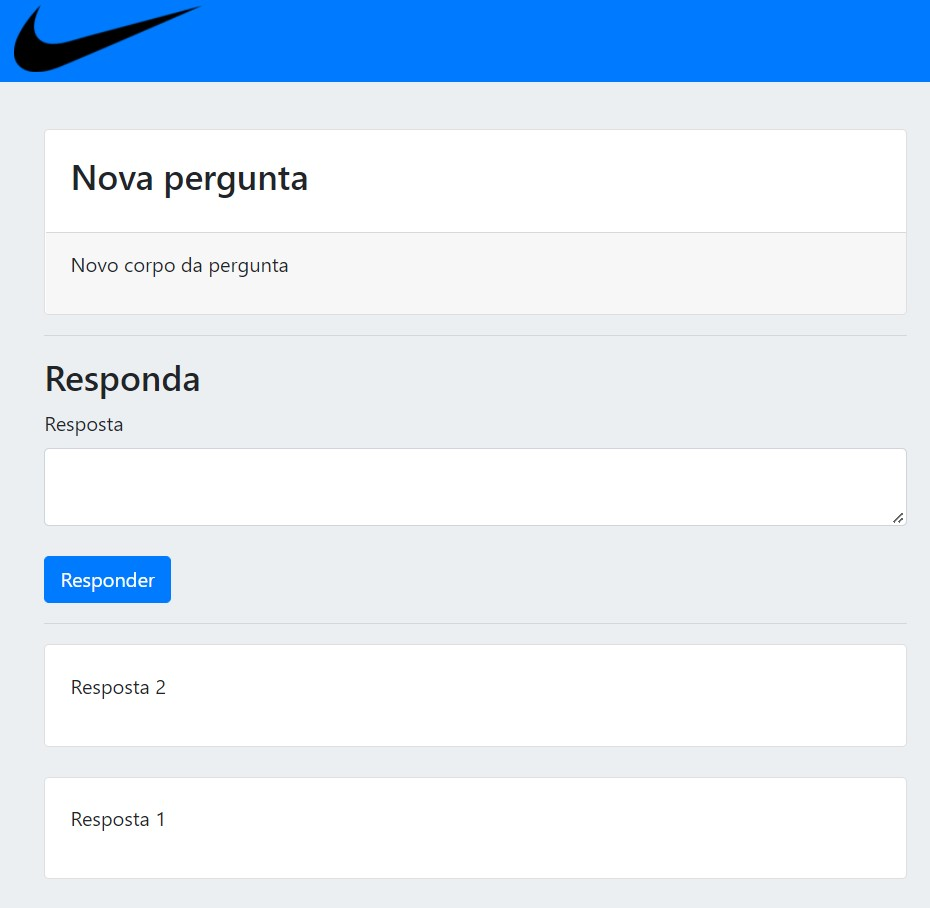

# Guia Perguntas

Sistema de perguntas com banco de dados desenvolvido em NodeJS + MySQL e estilo feito com Bootstrap.

   
  Vídeo 1: aplicação Guia Perguntas  em funcionamento.

## Como iniciar o projeto

  
Iniciando o projeto

  <ul>
    <li>Clone este repositório na sua máquina.</li>
    <li>Instale o <a href="https://bit.ly/3B6DxZn">MySQL Community e Workbench.</a></li>
    <li>Abra o MySQL Workbench e crie uma tabela chamada "guiaperguntas"</li>
    <li>Após isso, entre na pasta do projeto pelo CMD e digite o comando "node index.js"</li>
  </ul>

## Página inicial

A página inicial mostra as perguntas já feitas organizadas em ordem decrescente, da publicação mais recente para a mais antiga. Além disso, consiste também em:

- Botão "Perguntar": redireciona para a página de nova pergunta.
- Lista de perguntas: organizadas por ordem de publicação (mais recente para mais antiga).
- Botão "Responder": redireciona para a pagina de respostas das perguntas.

   
  Figura 1: Página inicial

## Página de Perguntas

A página de perguntas é composta dos seguintes campos:

- Título: para inserir um título curto sobre a dúvida em questão.
- Pergunta: para inserir detalhes da dúvida em questão.
- Botão "Perguntar": encaminha para o banco de dados a pergunta, que será mostrada na página inicial para ser respondida por outros usuários. 

   
  Figura 2: Página de perguntas

## Página de Resposta

A página de resposta consiste dos seguintes campos:

- Resposta: onde o usuário deve digitar detalhadamente a resposta para a pergunta em questão.
- Botão "Responder": assim que o usuário estiver satisfeito com a sua resposta para a pergunta, basta clicar nesse botão para enviar a resposta para o banco de dados.
- Lista de respostas: organizada em ordem de publicação, da mais recente para a mais antiga.

   
  Figura 3: Página de resposta

